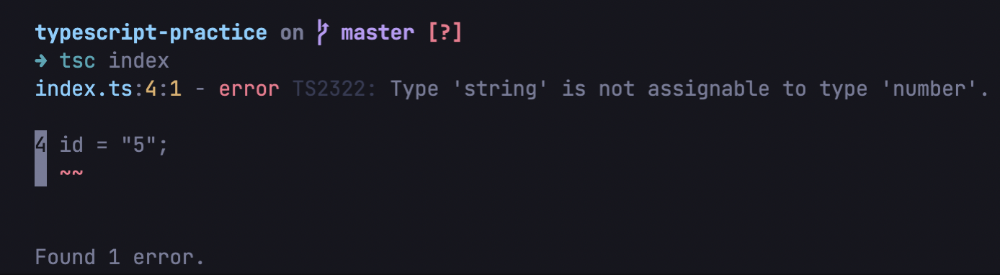
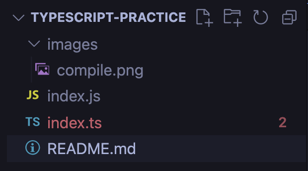
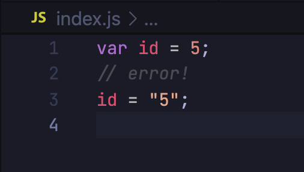
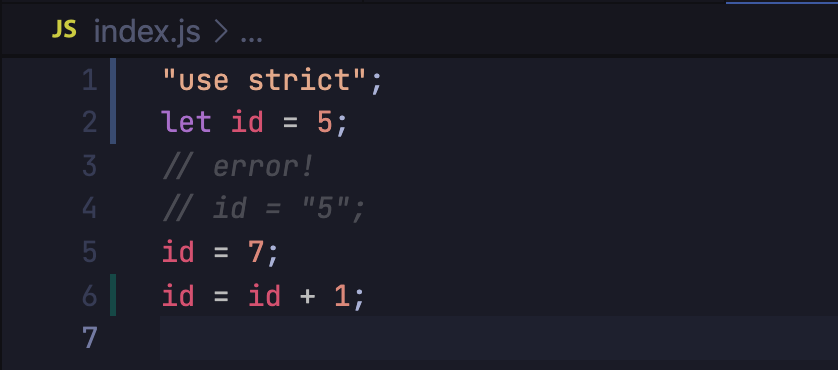

# Typescript practice 🫐

## Install `typescript` 📦

- `sudo npm i -g typescript`
- check version: `tsc -v`

## Compile a `typescript` file 👩‍💻

- `tsc [filename]`
- compiling the file will show all possible errors:
  
- after file being compiled, a `js` version of the file is being created:
  
- the compiled `js` file is converting by default to ES5:

  

## Watch a file 👀

- `tsc --watch [filename]`

## Configuration file 🍬

- `tsc --init` => creates `tsconfig.json`
- under `compilerOptions`, change the `target` to `es6`
- run `tsc` again (no filename needed) and new `js` files is being created:

  

## Project structure 🗼

- the `typescript` files are in a separated source folder and the javascript files in a `dist` folder
- have to specify `"outDir": "./dist"` and `"rootDir": "./src"`

### Interesting! 🤓

check how the `enum` is being compliled into in the `js` file!

## Interfaces 🚦

- NOT used with primitives
- used with objects
- optional properties
- `readonly` properties
